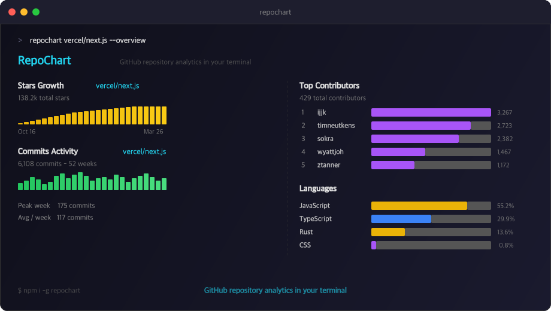

# RepoChart



GitHub repository analytics — right from your terminal.

```
npx repochart compare openclaw/openclaw vercel/next.js
npx repochart vercel/next.js --overview
npx repochart vercel/next.js --chart stars
npx repochart vercel/next.js --chart commits
npx repochart vercel/next.js --chart contributors
npx repochart vercel/next.js --chart languages
```

## Prerequisites

Requires the [GitHub CLI](https://cli.github.com) to be installed and authenticated:

```bash
brew install gh   # macOS
gh auth login
```

## Install

```bash
npm install -g repochart
```

Or run without installing:

```bash
npx repochart openclaw/openclaw --overview
```

## Usage

```
repochart <owner/repo> [options]
repochart compare <repo1> <repo2>

Arguments:
  <repo>              Repository in owner/repo format (e.g., vercel/next.js)

Options:
  --chart <type>      Chart type: stars | commits | contributors | languages  (default: stars)
  --overview          Show all stats at once: stars, commits, contributors, languages
  --all               Fetch all pages (may be slow for large repos)
  -v, --version       Output the version number
  -h, --help          Display help
```

## Commands

| Command / Flag | Description |
|----------------|-------------|
| `--chart stars` | Cumulative star growth sparkline |
| `--chart commits` | Weekly commit activity (last 52 weeks) |
| `--chart contributors` | Top 15 contributors by commits |
| `--chart languages` | Language breakdown with bar chart |
| `--overview` | All four charts in one command |
| `compare <repo1> <repo2>` | Side-by-side comparison of two repos |

## Compare two repos side by side

```bash
npx repochart compare vercel/next.js facebook/react
```

Fetches all stats for both repos in parallel and renders them side by side in the terminal, split by a `│` divider:

```
vercel/next.js                            │  facebook/react
──────────────────────────────────────────┼──────────────────────────────────────────

⭐ Stars                                  │  ⭐ Stars
  138.2k total stars                      │    243.6k total stars
  ▁▁▂▃▄▅▆▇████████████████████████████   │    ▁▁▁▂▃▄▅▆▇███████████████████████████
  Since  Oct 25, 2016                     │    Since  May 29, 2013

──────────────────────────────────────────┼──────────────────────────────────────────

📊 Commits  last 52 weeks                 │  📊 Commits  last 52 weeks
  6,108 commits                           │    1,440 commits
  ▁▂▃▄▅▆▇████████████████████████████    │    ▁▁▂▂▃▃▄▄▅▅▆▆▇▇████████████████████
  Peak  175  Avg  117                     │    Peak  83  Avg  29

──────────────────────────────────────────┼──────────────────────────────────────────

👥 Contributors  429 total                │  👥 Contributors  411 total
   1  ijjk              ████████████  3,267  │     1  sebmarkbage  ████████████  1,939
   2  timneutkens       ████████░░░░  2,723  │     2  zpao         ████████░░░░  1,728
   3  sokra             ███████░░░░░  2,382  │     3  gaearon      ███████░░░░░  1,682
  ...                                    │    ...

──────────────────────────────────────────┼──────────────────────────────────────────

🌐 Languages                              │  🌐 Languages
  JavaScript  ████████████████░░░  55.2%  │    JavaScript  ████████████████░░░  68.1%
  TypeScript  ██████░░░░░░░░░░░░░  29.9%  │    TypeScript  █████░░░░░░░░░░░░░░  29.2%
  Rust        ████░░░░░░░░░░░░░░░  13.6%  │    HTML        █░░░░░░░░░░░░░░░░░░   1.4%
```

The winner in total stars and total commits is highlighted in **green**.

## Overview — all stats at once

```bash
npx repochart vercel/next.js --overview
```

Fetches stars, commits, contributors, and languages in parallel and renders all four charts sequentially in your terminal.

## Authentication

RepoChart uses the **GitHub CLI** (`gh`) for all API calls — no tokens to manage. Just run `gh auth login` once and you're set. Authenticated requests get 5,000 req/hour vs 60 for unauthenticated.

## Examples

```bash
# No install needed — run directly with npx
npx repochart vercel/next.js --overview
npx repochart compare vercel/next.js facebook/react
npx repochart compare microsoft/vscode neovim/neovim
repochart vercel/next.js --chart commits
repochart microsoft/vscode --chart languages
```

## Development

```bash
pnpm install
pnpm build        # compile TypeScript → dist/
pnpm test         # run vitest
```

## License

MIT

---

Built with [commandcode](https://commandcode.ai) by [@saqibameen](https://x.com/saqibameen)
